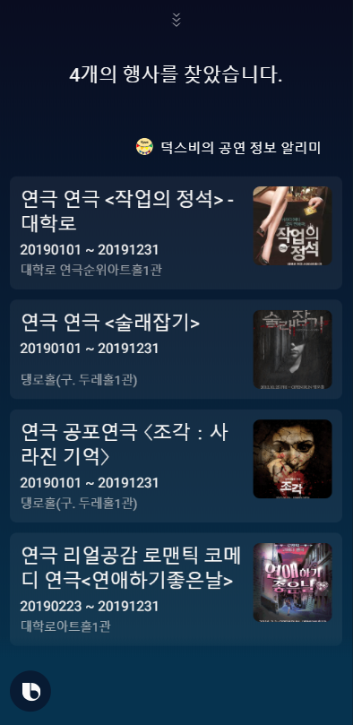
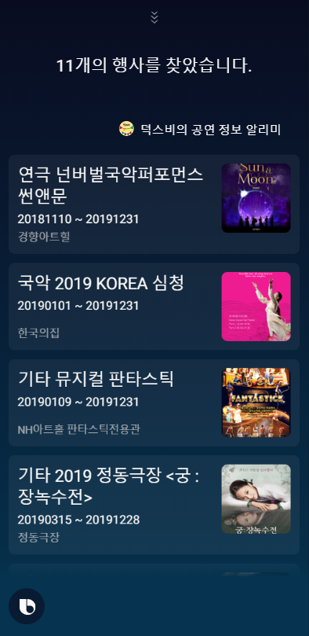
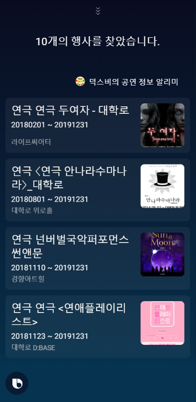

# duxby
> 덕스비는 날짜, 분야, 지역에 대해서 축제, 공연에 대한 정보를 제공합니다.
### [빅스비 챕슐 챌린지 2019 입선](https://bixby.developer.samsung.com/newsroom/ko-kr/%EA%B3%B5%EC%A7%80-%E2%80%98%EB%B9%85%EC%8A%A4%EB%B9%84-%EC%BA%A1%EC%8A%90-%EC%B1%8C%EB%A6%B0%EC%A7%80-2019-%EA%B2%B0%EC%84%A0-%EC%A7%84%EC%B6%9C%EC%9E%91-%EB%B0%8F-%EC%9E%85%EC%84%A0%EC%9E%91%EC%9D%84-%EB%B0%9C%ED%91%9C%ED%95%A9%EB%8B%88%EB%8B%A4)

### 주요 기능
 1. findFestByArea(sido,gugun) 시,군
    - __시,군__ 을 입력하여 그 지역에서 진행하고 있는 행사들을 제공
 2. findFestByRealm(sido,gugun,realmName) (realmName: 연극,뮤지컬,콘서트,음악,무용,미술...)
    - __종류__ 를 입력하여 그 종류에 해당하는 행사들을 제공
 3. findFestByThisMonth(이번달)
    - __이번 달__ 을 입력하여 이번 달에 진행되고 있는 행사들을 제공
 4. findFestByThisWeek(이번주)
    - __이번 주__ 를 입력하여 이번 주에 진행되고 있는 행사들을 제공
 5. findFestBySelectMonth(월 선택)
    - __월__ 을입력하여 그 월에 진행되고 있는 행사들을 제공   
    
---

### 구동 화면
* 발화: 12월 행사 보여줘

* 발화: 서울 중구의 축제 보여줘

* 발화: 연극 뭐 볼까?

* 발화: 이번 주 공연 보여줘(해당하는 공연이 없을 시 화면)

---

### 아쉬운 점
 * 너무 적은 발화 목록
 * 공공 데이터 API 오류
